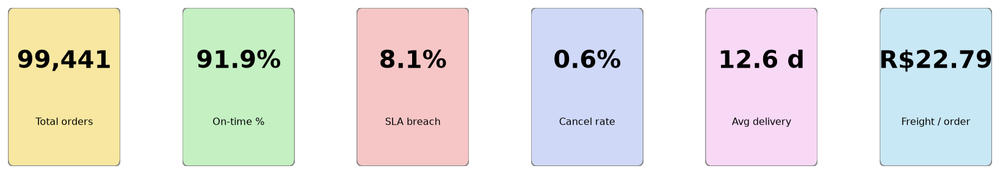
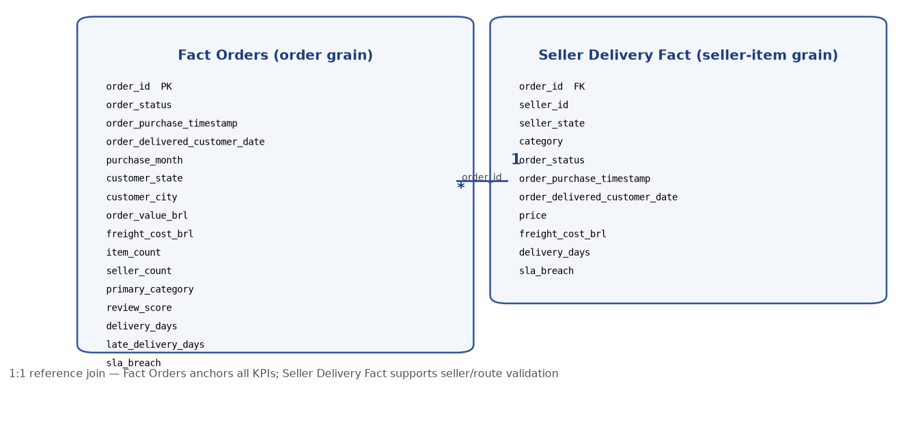
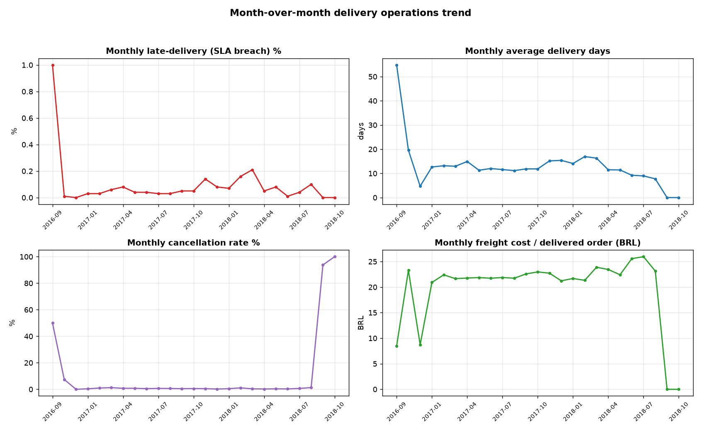
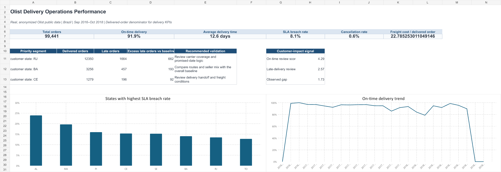

# Olist Delivery Operations Performance

**Stack: PostgreSQL | Python | Excel | Power BI**

---

## Executive Summary

This project analyzes **99,441 real, anonymized Brazilian e-commerce orders** from Olist (Sep 2016 – Oct 2018) to identify delivery-performance priorities and quantify their operational and financial impact.

### The headline: 8.1% SLA breach is eroding customer trust

| Metric | Value | Why it matters |
|---|---|---|
| **SLA breach rate** | **8.1%** (7,826 late orders) | Nearly 1 in 12 delivered orders misses its promised date |
| **Review score gap** | **2.57 late vs 4.29 on-time** | A **1.73-point drop** — late delivery is strongly associated with customer dissatisfaction |
| On-time delivery | 91.9% | The baseline most orders meet |
| Avg delivery time | 12.56 days | From purchase to customer doorstep |
| Cancellation rate | 0.63% (625 orders) | Low, but still lost revenue |
| Freight cost / delivered order | R$22.79 | A logistics cost proxy |

> **Operational implication:** Late deliveries are not just a logistics inconvenience — they directly correlate with a **40% lower review score** (2.57 vs 4.29). With 7,826 late orders representing **R$1.16M in order value** and **R$193K in freight costs**, the financial exposure is material. The review-score damage suggests long-term customer-value erosion beyond the immediate transaction.

### Where to investigate first: RJ, BA, CE

The biggest priority segment is customer state **RJ** (Rio de Janeiro): it had **1,664 late deliveries — approximately 662 more than expected** at the overall late-delivery rate. **BA** (Bahia) follows with ~193 excess, and **CE** (Ceará) with ~92 excess.

> **Causality disclaimer:** These are **associations, not proven causes**. The RJ finding does not prove that RJ operations cause late delivery. Route, carrier, seller, and inventory data must be validated before intervention. See [Limitations](#limitations-and-causality-disclaimer).

---

## KPI Cards



---

## Business Problem

An Operations Manager needs to monitor late delivery, cancellations, freight cost, customer impact, seller performance, and geographic variation — then identify **where to investigate first** and **what it costs**.

This project answers four questions:

1. **How bad is late delivery?** → 8.1% SLA breach, 2.57 vs 4.29 review-score gap
2. **Where is it worst?** → RJ, BA, CE states; specific high-delay sellers; cross-state routes
3. **Is it getting worse?** → Monthly trend analysis shows SLA breach peaked at 21% in Mar 2018
4. **What does it cost?** → R$1.16M order value + R$193K freight exposed to late delivery

---

## Data Source & Scope

**Source:** [Olist Brazilian E-Commerce Public Dataset](https://www.kaggle.com/datasets/olistbr/brazilian-ecommerce) — real anonymized marketplace activity in Brazil from **September 2016 to October 2018**.

Includes 99,441 orders, 96,478 delivered orders, 112,650 order items, 3,095 sellers, 32,951 products, and 99,224 reviews. The original source tables are preserved in `data/source_olist/`.

---

## Data Model



**`Fact Orders`** is the main fact table — one row per order, built from the relational source data. The report models with **Date**, **Customer State**, **Category**, and **Status** dimensions.

**`Seller Delivery Fact`** supports seller comparisons at **seller-item grain**, avoiding false order-level seller attribution when an order has several sellers.

| Fact Table | Grain | Rows | Key Measures |
|---|---|---|---|
| `fact_orders.csv` | One row per order | 99,441 | order_value_brl, freight_cost_brl, delivery_days, sla_breach, review_score |
| `seller_delivery_fact.csv` | One row per seller-item | 112,650 | price, freight_cost_brl, delivery_days, sla_breach |

---

## KPI Definitions

| KPI | Definition |
|---|---|
| On-time delivery % | Delivered orders on or before their promised date ÷ delivered orders |
| Average delivery time | Average days from order date to delivered date; cancelled orders excluded |
| SLA breach rate | Delivered orders after their promised date ÷ delivered orders |
| Cancellation rate | Cancelled orders ÷ all orders |
| Freight cost per delivered order | Freight value ÷ delivered orders; a logistics cost proxy, not full fulfillment cost |

---

## Analysis Approach

1. **Validate** status/date sequences, nulls, duplicate IDs, and key delivery fields
2. **Calculate** operational KPIs with explicit denominators
3. **Compare** performance by month, region, seller, and category
4. **Rank** state/category priority segments by excess late orders versus the overall late-delivery baseline
5. **Recommend** operational validation steps rather than claiming causality from observational data

---

## Key Findings

### 1. Priority Segments — Where late delivery concentrates

| Rank | Segment | Late Orders | Excess vs Baseline | Avg Late Days | Recommended Validation |
|---|---|---|---|---|---|
| 1 | **RJ** customer state | 1,664 | **~662** | 12.9 | Carrier coverage and promised-date logic |
| 2 | **BA** customer state | 457 | **~193** | 13.4 | Route and seller-mix comparison |
| 3 | **CE** customer state | 196 | **~92** | 14.2 | Delivery handoff and freight review |
| 4 | MA customer state | 268 | ~83 | 13.8 | Seller concentration analysis |
| 5 | ES customer state | 218 | ~82 | 12.5 | Cross-state route review |

**Category-level:** `health_beauty` (76 excess late) and `bed_bath_table` (67 excess late) are the top product-category segments.

### 2. Seller Analysis — High-delay sellers and revenue exposure

Seller performance is measured at **seller-item grain** to avoid misattributing lateness when an order has multiple sellers.

| Seller (short) | State | Delivered Items | Late Rate | Excess Late Items | Late Item Value (BRL) | Avg Delivery Days |
|---|---|---|---|---|---|---|
| `06a2c3af…` | MA | 402 | **23.6%** | **63.2** | R$8,204 | 17.7 |
| `4a3ca931…` | SP | 1,949 | 11.0% | **59.9** | R$22,508 | 14.4 |
| `81602554…` | SP | 424 | **17.9%** | **42.5** | R$8,220 | 16.8 |
| `4869f7a5…` | SP | 1,148 | 11.6% | **42.2** | R$26,854 | 15.0 |
| `88460e8e…` | PR | 300 | **19.7%** | **35.3** | R$6,990 | 18.3 |

**Key insight:** The top 5 high-delay sellers account for **~243 excess late items** and **R$72,876 in late item value**. Seller `06a2c3af` (MA) has a 23.6% late rate — nearly 3× the platform average — making it a top candidate for operational review.

> **Note:** Seller `2709af95` (SP) has a 50% late rate but only 25 orders — small sample, lower priority than high-volume offenders.

### 3. Route & Distance Analysis — Does geography explain state differences?

**Yes — cross-state delivery is a significant risk factor.**

| Route Type | Delivered Items | Late Items | Late Rate |
|---|---|---|---|
| **Same state** | 39,866 | 2,384 | **5.98%** |
| **Different state** | 70,331 | 6,330 | **9.00%** |

Cross-state deliveries are **50% more likely to be late** than same-state deliveries.

**Worst routes by late rate** (min 30 items):

| Route | Delivered Items | Late Rate | Late Items |
|---|---|---|---|
| AL ← PR | 43 | **46.5%** | 20 |
| SP ← MA | 130 | **26.9%** | 35 |
| AL ← SP | 273 | **25.3%** | 69 |
| CE ← RJ | 56 | **25.0%** | 14 |
| MA ← SP | 549 | **22.2%** | 122 |

**High-volume worst routes:**

| Route | Delivered Items | Late Rate | Late Items |
|---|---|---|---|
| RJ ← SP | 9,403 | **14.9%** | 1,396 |
| BA ← SP | 2,626 | **14.8%** | 388 |
| ES ← SP | 1,621 | **14.0%** | 227 |
| CE ← SP | 1,091 | **15.4%** | 168 |

**Key insight:** The RJ state-level problem is partly a **route problem** — RJ←SP alone accounts for 1,396 late items at 14.9%. Sellers in SP shipping to RJ are a major contributor. This suggests the issue is not just "RJ is far" but specific **seller-state to customer-state corridors** that need carrier and route-level investigation.

### 4. Trend Analysis — Is late delivery getting worse?



| Period | SLA Breach % | Avg Delivery Days | Cancellation % | Freight/Order (BRL) |
|---|---|---|---|---|
| 2017 Q1 (Jan–Mar) | 3–6% | 12.7–13.2 | 0.4–1.2% | R$21.7–22.4 |
| 2017 Q2 (Apr–Jun) | 4–8% | 11.3–14.9 | 0.5–0.8% | R$21.7–21.9 |
| 2017 Q3 (Jul–Sep) | 3–5% | 11.2–11.9 | 0.5–0.7% | R$21.7–22.6 |
| **2017 Nov** | **14%** | **15.2** | 0.5% | R$22.7 |
| 2017 Dec | 8% | 15.4 | 0.2% | R$21.2 |
| 2018 Jan | 7% | 14.1 | 0.5% | R$21.7 |
| **2018 Feb** | **16%** | **17.0** | 1.1% | R$21.3 |
| **2018 Mar** | **21%** | **16.3** | 0.4% | R$23.9 |
| 2018 Apr | 5% | 11.5 | 0.2% | R$23.4 |
| 2018 May | 8% | 11.4 | 0.4% | R$22.4 |
| 2018 Jun | 1% | 9.2 | 0.3% | R$25.6 |
| 2018 Jul | 4% | 9.0 | 0.7% | R$26.0 |
| 2018 Aug | 10% | 7.7 | 1.3% | R$23.1 |

**Key insights:**
- **SLA breach peaked at 21% in March 2018** — more than double the 8.1% average
- **Nov 2017 and Feb–Mar 2018** were the worst periods, likely driven by holiday volume and carrier strain
- **Average delivery time peaked at 17 days** in Feb 2018
- **Freight cost trended upward** from ~R$21 to ~R$26 over the period
- **Cancellation rate spiked to 1.3%** in Aug 2018
- The second half of 2018 shows **improvement** — SLA breach dropped to 1–10% range

### 5. Financial Impact — What late delivery costs

| Metric | Value |
|---|---|
| Late orders | **7,826** (8.1% of 96,478 delivered) |
| Late order value | **R$1,158,920.51** |
| Late freight cost | **R$192,704.45** |
| Late order value share | **8.77%** of total delivered value |
| Late freight share | **8.77%** of total delivered freight |
| Review score gap | **1.73 points** (2.57 vs 4.29) |

**Customer-value exposure:** With a 1.73-point review-score gap, late deliveries are associated with significantly lower customer satisfaction. If even a fraction of the 7,826 late-order customers churn or reduce future purchases, the **lifetime-value erosion** could far exceed the R$1.16M in direct order value.

**Freight exposure:** R$192,704 in freight was spent on late deliveries — carrier performance on these routes is not just a service issue but a **cost-efficiency problem**.

---

## Dashboard Preview

### Excel Dashboard



Built with `build_olist_workbook.mjs` — 8 tabs: Dashboard, Metrics, Monthly Trend, State Performance, Category Performance, Seller Performance, Data Quality, Methodology.

### Power BI Dashboard

The Power BI project includes a **3-page dashboard** (Executive Overview, Delivery & SLA, Freight & Priorities) with DAX measures, slicers, and interactive visuals.

**Files:**
- `powerbi/olist_delivery_operations.pbit` — compiled Power BI template; open in Power BI Desktop, refresh against local CSVs, then **Save As → .pbix** to embed cached data
- `powerbi/olist_delivery_operations/` — full PBI Desktop source project (TMDL data model + PBIR report JSON)
- `powerbi/DAX_Measures.md` — import steps, DAX measures, and page specification
- `powerbi/generate_powerbi_project.py` — regenerates the PbixProj source tree

**DAX measures included:** Total Orders, Delivered Orders, Cancelled Orders, Cancellation Rate, On-Time Deliveries, On-Time %, SLA Breaches, SLA Breach Rate, Average Delivery Days, Freight Cost per Delivered Order.

---

## Deliverables

### Data (`data/processed/`)

| File | Description |
|---|---|
| `fact_orders.csv` | One row per order (99,441 rows, 21 columns) |
| `seller_delivery_fact.csv` | One row per seller-item contribution (112,650 rows) |
| `priority_segments.csv` | State + category segments ranked by excess late orders |
| `state_performance.csv` | KPI by customer state (27 states) |
| `category_performance.csv` | KPI by product category (72 categories) |
| `seller_performance.csv` | KPI by seller (416 sellers, ≥50 delivered) |
| `seller_late_exposure.csv` | Seller-level excess late items and revenue exposure |
| `route_performance.csv` | Late rate by seller-state → customer-state route |
| `monthly_performance.csv` | KPI by purchase month (25 months) |
| `monthly_trend.csv` | Monthly SLA breach %, avg delivery, cancellation, freight |
| `data_quality_checks.csv` | 4 data-quality checks (all passing) |
| `project_metrics.json` | 11 overall KPIs |
| `financial_impact.json` | Late-order financial exposure |

### SQL (`sql/`)

| File | Description |
|---|---|
| `00_schema.sql` | PostgreSQL DDL — 7 tables + 3 indexes |
| `01_build_fact_orders.sql` | `fact_orders` view (CTEs for items + reviews) |
| `02_validate_and_analyze.sql` | DQ checks + KPI scorecard + priority segments |
| `03_load_and_run.sql` | Full load-and-run orchestrator (validated on PostgreSQL 16) |

### Excel (`excel/`)

| File | Description |
|---|---|
| `operations_review.xlsx` | 8-tab management review workbook with dashboard |

### Power BI (`powerbi/`)

| File | Description |
|---|---|
| `olist_delivery_operations.pbit` | Compiled PBI template |
| `olist_delivery_operations/` | Full PbixProj source tree |
| `DAX_Measures.md` | DAX measures + page spec |
| `generate_powerbi_project.py` | Regenerates the PbixProj source |

### Images (`images/`)

| File | Description |
|---|---|
| `olist_dashboard_preview.png` | Excel dashboard render |
| `kpi_cards.png` | 6 KPI cards row |
| `monthly_trend.png` | 2×2 trend chart |
| `data_model.png` | Fact Orders / Seller Delivery Fact diagram |

---

## How to Reproduce

```bash
# 1. Rebuild processed data from source CSVs
python prepare_olist_data.py

# 2. Run analytics (seller, route, trend, financial)
python analyses/run_analytics.py

# 3. Generate images (KPI cards, trend, data model)
python analyses/make_assets.py

# 4. Build Excel workbook + dashboard preview
node build_olist_workbook.mjs

# 5. Validate workbook renders and KPIs match
node verify_olist_project.mjs
```

The earlier mock-data version of this project is preserved untouched under `archive/mock_data_version/` and is not part of the current workflow.

---

## Interview Talking Points

- **Why cancelled orders are excluded** from delivery-time and SLA denominators — they have no delivery outcome.
- **Why seller analysis uses seller-item grain** while KPIs use order grain — avoids false attribution in multi-seller orders.
- **Association vs. causation** — the RJ finding is an observed priority segment, not a proven cause. Operational validation (carrier scans, inventory, route data) is required before intervention.
- **How to refresh the report** — rerun `prepare_olist_data.py` → `run_analytics.py` → `build_olist_workbook.mjs` when new order data arrives.
- **Route-level insight** — cross-state deliveries are 50% more likely to be late; RJ←SP is the highest-volume problem corridor.
- **Financial framing** — R$1.16M order value + R$193K freight exposed, plus 1.73-point review-score gap suggesting customer-value erosion.

---

## Limitations and Causality Disclaimer

> **This is an observational analysis, not a causal study.**

- The public source supports an end-to-end portfolio workflow but **does not include carrier scan events, inventory availability, or a validated causal label**.
- The RJ/BA/CE priority segments are **associations** — they identify where late delivery concentrates, not why it causes it.
- The 2.57 vs 4.29 review-score gap is a **correlation** — late delivery and low reviews co-occur, but other factors (product quality, customer expectations) may contribute.
- Route analysis uses **seller state → customer state** as a proxy for distance; actual shipping distance and carrier performance data would strengthen the finding.
- For production, integrate carrier scan events, inventory data, and track interventions against a **controlled baseline**.

---

## Next Steps

1. **Validate RJ finding** with carrier-level data — is it a specific carrier, route, or warehouse?
2. **Investigate top sellers** — seller `06a2c3af` (MA, 23.6% late rate) and `4a3ca931` (SP, 59.9 excess late items)
3. **Address cross-state routes** — RJ←SP, BA←SP, ES←SP corridors need carrier performance review
4. **Monitor the Nov–Mar peak** — holiday-season capacity planning for 2018 Q4
5. **Integrate customer lifetime value** — quantify churn risk from the 1.73-point review-score gap
